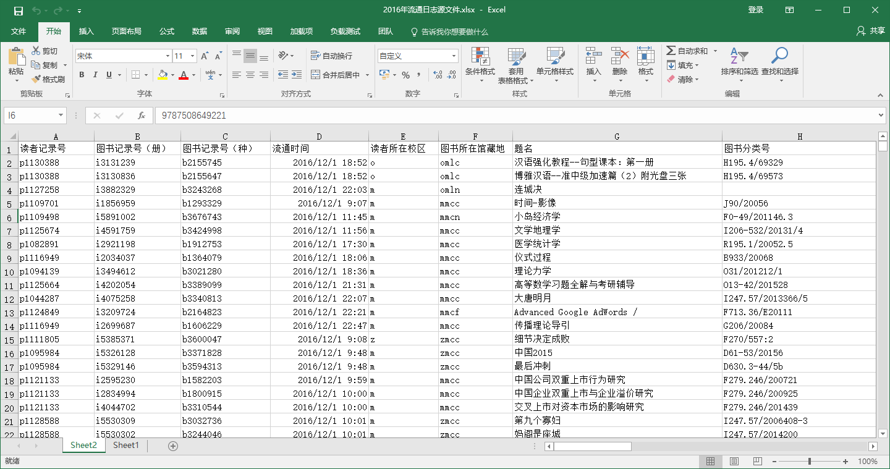

<!-- FP-Growth 和 K-Means 学习报告 -->

**最近学习了数据挖掘常用的两种算法：FP-Growth 和 K-Means。现在把我的学习结果分享给大家。**

文中的引用以上标表示。所有源代码都可以在我的 GitHub：[https://github.com/K9A2/DataMining](https://github.com/K9A2/DataMining) 上找到。大家也可以到我的网站查看更多新鲜内容：[http://www.stormlin.com](http://www.stormlin.com)。

## 1. FP-Growth

在生活中，我们常常会遇到一些需要分析事物之间的关联性的场合。例如，在分析超市的销售数据时，我们可能会想知道，顾客在买牛奶的时候，还会买什么别的东西。还有数据挖掘领域里面著名的啤酒与尿布的故事<sup>R1</sup>。

要解决这些问题，我们就需要一种算法来帮我们寻找这些事务项之间的关联性。常用的**关联分析（Association Analysis）**
算法有 Apriori 算法和 FP-Growth 算法。Apriori 算法的时空复杂度都比较高，现在已经不常用了，故本文略去对 Apriori 算法的介绍，专注于对 FP-Growth 的介绍与分析。

### 1.1 支持度计数筛选

在 FP-Growth 算法里面，需要对每一个事项计算各自的**支持度计数**（即此事务在全集中出现的次数）。如果支持度不满足设定的最小值，那么这项记录将不能被算法所收录。

### 1.2 步骤简介

FP-Growth 的步骤相对于 Apriori 会简单一点，但绝对值也不低。其伪代码步骤简介如下<sup>R5</sup>：
```java
输入：事务集合 List<List<String>> transactions
输出：频繁模式集合 List<List<String>> fpOutput
 
public void getFPOutput(List<List<String>> transactions, List<String> postPattern, List<List<String>> fpOutput) {
    构建头表项 HeaderTable：buildHeaderTable(transactions);
    构建 FP 树：buildFPTree(headerTable, transactions);
    if (树空) return;
    输出频繁项集;
    遍历每一个头项表节点并递归;
}
```
具体操作步骤请参考源代码。

### 1.3 实例分析

#### 1.3.1 Overview

针对 FP-Growth 的实例分析，我们采用了一个具有 27 万测试数据的数据集（示例见 Fig.1，可以通过[度盘链接](http://pan.baidu.com/s/1eRZ0vke)下载）。在经过预处理阶段之后（即源代码中的 `preProcess` 方法），数据量下降为 6 万多，全过程处理时间大约为 10 秒。不同机器可能需要不同的处理时间，具体请参照在程序起止是输出的时间戳。



测试程序主要采用了三级处理的方式，预处理、FP-Growth 计算频繁项集和重整输出三个阶段：
1.  预处理：<br>
    `fpInput = preProcess(csvFilePath, inputSeparator, requiredClass);`
2.  FP-Growth 算法生成频繁项：<br>
    `FPGrowth fpGrowth = new FPGrowth(2);`<br>
    `fpGrowth.getFPOutput(fpInput, null, fpOutput);`
3.  重整输出：<br>
    `result = reProcess(dictionaryFilePath, fpSeparator, fpOutput)`

由于频繁项的计算已在 1.2 节中介绍，故以下只介绍预处理和重整输出两个阶段。

##### 1.3.1.1 预处理

预处理阶段的主要任务是为 FP-Growth 准备需要的输入数据。

如前文所述，原始数据为日志文件，其数据项按行排列，并非 FP-Growth 所要求的多个事物项处在同一行。故预处理阶段的第一个任务就是把这些“属于”同一行的数据全部合并到同一行中：
```java
算法输入：
    1.  String csvFilePath：以 CSV 文件格式存储的原始数据
    2.  String inputSeparator：CSV 文件中用来分隔同一行中的不同数据项的分隔符
    3.  String targetClass：目的图书分类
    
算法输出：
    List<List<String>> FPInput：FP-Growth 算法输入数据

List<List<String>> preProcess(String csvFilePath, String inputSeparator, char targetClass) {
    //1.读取 CSV 文件，构建原始输入
    ...
    //2.筛选出符合类别要求的记录项
    ...
    //3.读取数据并合并同一次结束记录的连续几行记录
    ...
    return FPInput;
}
```

##### 1.3.1.2 重整输出

重整输出阶段的任务就是把 FP-Growth 算法输出的杂乱无章的结果重整为在条目之间具有唯一性的输出结果。
```java
算法输入：
    1.  String dictionaryFilePath：CSV 文件格式的书名字典文件的位置
    2.  String dictionarySeparator：字典文件中每一行的各项之间的分隔符
    3.  List<List<String>> fpOutput：欲处理的 FP-Growth 输出

算法输出：
    List<List<String>> result：可以直接输出的结果

List<List<String>> reProcess(String dictionaryFilePath, String dictionarySeparator, List<List<String>> fpOutput) {
    //1.制作字典
    Dictionary<String, String> dictionary = new Hashtable<>();
    ...
    //2.合并与去重
    getResultFiltered(result, fpOutput);
    //3.替换其中的书号以得到最终结果
    ...
    return result;
}
```

其中，`getResultFiltered(List<List<String>> result, List<List<String>> removedPrefix)` 会在下一节详细介绍。

#### 1.3.2 如何把 FP-Growth 算法的输出还原成可阅读的频繁项集？

FP-Growth 算法输出是杂乱无章的，所以我们就需要对它的输出进行重整。而为了尽可能扩大相关联事务的范围，我们采用了合并所有有交集的行的方法：
```java
算法输入：
    1.  List<List<String>> result：处理结果
    2.  List<List<String>> fpOutput：FP-Growth 处理结果与应用场合

算法输出：
    在参数 result 中

private static void getResultFiltered(List<List<String>> result, List<List<String>> fpOutput) {
    //合并与去重
    HashSet<String> temp = new HashSet<>();
    int elementLeft = fpOutput.size();
    //任意两行之间如果有交集，就合并他们
    while (fpOutput.size() != 0) {
        temp.addAll(fpOutput.get(0));
        for (int j = 1; j < elementLeft - 1; j++) {
            //若两项之间有交集，则 isIntersected 返回 true
            if (isIntersected(temp, fpOutput.get(j))) {
                temp.addAll(fpOutput.get(j));
                fpOutput.remove(j);
                elementLeft--;
                j--;
            }
        }
        result.add(new ArrayList<>(temp));
        temp.clear();
        elementLeft--;
        fpOutput.remove(0);
    }
}
```
以上算法中，HashSet 的使用有效加快了匹配的速度。同时，由于算法会删去已添加的行，重整算法的时间复杂度近似为 O(nlogn)，空间复杂度不会超过输入数组的大小，即 O(n)。

#### 1.3.3 如何判断两个频繁项之间有交集？

为了能尽可能地扩大结果中一条频繁项集的数据，为推荐算法提供更多样化的结果，在合并频繁项集的时候，需要判断两个频繁项之间是否有交集。如果两个频繁项之间有交集，则合并两者。
```java
算法输入：
    1.  HashSet<String> a：已有结果的条件模式基
    2.  List<String> b：需要检测的频繁项集

算法输出：
    true：两者之间有交集
    false：两者之间无交集

private static boolean isIntersected(HashSet<String> a, List<String> b) {
    for (String anA : a) {
        for (String aB : b) {
            if (anA.equals(aB)) {
                return true;
            }
        }
    }
    return false;
}
```

据其他资料分析，使用 List 的 retainAll() 方法也能检测两者之间是否有交集，大家可以去试试这种方法。

#### 1.3.4 处理结果与应用场合

本算法能在给定的事务集中高效计算频繁项集。那么，我们就能把这个算法移植到服务器端，并在小数据量的情况下实现根据用户的指定的类别，实时计算频繁项集，并在结果页面推荐给用户。

## 2. K-Means

在对数据进行了关联分析之后，有时候还需要对数据进行**聚簇分析（Clustering Analysis）**。聚类分析的算法较多，这里只介绍 K-Means 算法。这个算法的输入有数据集和分类数目 K；输出是分在 K 个簇中的数据项。

### 2.1 分类原理

分类主要涉及计算欧几里得距离和计算一群质点的质心两个算法，下面分别介绍：

#### 2.1.1 欧几里得距离的高效计算

分类的方法主要是计算某个点与所有 K 个质心之间的欧几里得距离。计算两个 n 维点之间的欧几里得距离<sup>R4</sup>：


实用的计算方法：
```java
private static double getEuclidDistance(Point a, Point b) {
    double result = 0;
    result += Math.pow(a.getX() - b.getX(), 2);
    result += Math.pow(a.getY() - b.getY(), 2);
    result += Math.pow(a.getZ() - b.getZ(), 2);
    return Math.sqrt(result);
}
```

#### 2.1.2 计算质心的方法：

在 K-Means 算法中，分类需要按照欧几里得距离最小的原则。但在实用的算法中，通常采用重心来代替质心：
```java
private static Point getClusterCenter(List<Point> points) {
    if (points.size() == 0) {
        return null;
    }
    if (points.size() == 1) {
        return new Point(points.get(0).getX(), points.get(0).getY(), points.get(0).getZ());
    }
    double x = 0;
    double y = 0;
    double z = 0;
    for (Point point : points) {
        x += point.getX();
        y += point.getY();
        z += point.getZ();
    }
    x = x / points.size();
    y = y / points.size();
    z = z / points.size();
    return new Point(x, y, z);
}
```

### 2.2 步骤简介

K-Means 算法是一种很好理解的算法，其步骤异常简单。

1.  用户提供输入数据集。数据集中的每一项都需要包含若干属性。如输入一个二维点集，那其中的一项就需要至少包含 X 和 Y 两个坐标；
2.  由用户指定初始质心或者由算法在输入的数据集中随机选取 K 个点作为初始质心；
3.  计算每一项到每一个质心之间的欧几里得距离；
4.  按照欧几里得距离最小的原则，把这些点分到 K 个簇中的某一个；
5.  重新计算 K 个簇中的质心（通常用计算重心代替）；
6.  如果质心与分类时使用的质心相同，则算法结束；否则就需要重复 2-6 步。

### 2.3 计算实例

由于每一个点不仅仅需要保存自身的三轴坐标，同时还要保存自身的类别以及名字，故新建了用于表示点的 `Point` 类，并以 `Point[]` 来表示点集。

计算实例采用了 *CPDA 数据分析天地*提供的足球数据<sup>R3</sup>。由于设计的时候采用了三维点集，所以无法采用通常的二维分类着色图<sup>R2</sup>来表示，故直接输出三种分类。其实验结果如下：
```txt
日本,韩国,澳大利亚,
印尼,泰国,
中国,朝鲜,伊拉克,伊朗,沙特,阿联酋,卡塔尔,乌兹别克斯坦,巴林,阿曼,约旦,
```
其结果符合球队实际排位。

另外，由于本次实验中尚未添加对分类的排序功能，即在输出的时候并非按照质心的“权重”来进行排序，故输出的结果是不能直接提取到别的程序中的。

### 2.4 实现要点

#### 2.4.1 随机初始质心的获取

获取随机初始质心有两种方法：
1.  第一种是采用 `Collection.shuffle()` 来直接打乱排序，然后直接取前 K 位作为随机初始质心；
2.  第二种就是使用随机数。先计算出 K 个不重复的随机数，然后按照获得的随机数到 `Point[]` 数组中获取随机初始质心，其计算过程如下：
```java
private static int[] getUnrepeatedRandomNumbers(int min, int max, int count) {
        int[] result = new int[count];
        int i = 0;
        HashSet<Integer> temp = new HashSet<>();
        while (true) {
            if (temp.size() == count) {
                break;
            }
            temp.add((int) (Math.random() * (max - min)) + min);
        }
        for (Integer item : temp) {
            result[i] = item;
            i++;
        }
        return result;
}
```

#### 2.4.2 Point[] 数组的复制与判同
    
1.  如果直接调用系统提供的 `System.arraycopy(b, 0, a, 0, a.length)`，那在复制的时候就是浅复制：即两个数组都是“引用了”同一个来源。在其中一个数组被改变的时候，另外一个数组由于引用了同一块内存区域，其值也会被改变。故要实现数组的“深拷贝”，则需要自行编写复制方法：
```java
private static Point[] getArrayCopy(Point[] b) {
    Point[] a = new Point[b.length];
    if (a.length == 0 || b.length == 0) {
        return null;
    }
    System.arraycopy(b, 0, a, 0, a.length);
    return a;
}
```
2.  那么如何判断两个质心是否移动呢？我们可以直接采用逐行判断的方式：
```java
private static boolean isClusterCenterChanged(Point[] a, Point[] b) {
    for (int i = 0; i < a.length; i++) {
        if (a[i].getX() != b[i].getX()) {
            return true;
        } else if (a[i].getY() != b[i].getY()) {
            return true;
        } else if (a[i].getZ() != b[i].getZ()) {
            return true;
        }
    }
    return false;
}
```

在任意一次比较中，如果两者的 X、Y 和 Z 三个值中的任意一个不相等，方法就会返回 `true`，即质心已移动；否则返回 `false`，表示质心未移动。

## 3.Reference

1.  [Grant Stanley - Diapers, Beer, and Data Science in Retail](http://canworksmart.com/diapers-beer-retail-predictive-analytics/)
2.  [听云博客 - JAVA实现K-means聚类](http://www.tuicool.com/articles/VBBnie)
3.  [CPDA 数据分析天地 - 用K-means看透中国男足！](http://www.sohu.com/a/135368994_354986)
4.  [tianlan_new_start - 欧几里得距离、曼哈顿距离和切比雪夫距离](http://blog.csdn.net/tianlan_sharon/article/details/50904641)
5.  [人非木石_xst - 单机和集群环境下的FP-Growth算法java实现(关联规则挖掘)](http://blog.csdn.net/shimin520shimin/article/details/49281381)