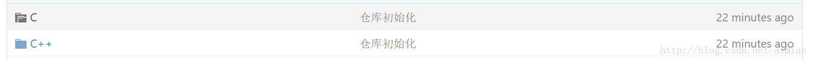

# 使用 Git 的时候遇到“modified content, untracked content”应该如何处理

## 问题描述

今天在使用 Git 创建并提交一个 Repo 到 Git 网站上的时候，在 GitHub 网站上发现提交的代码中有不能访问的文件夹。如下图中的灰色文件夹：

## 思考与解决

首先，肯定是这个文件夹没有被提交到服务器中。

使用`git status`，查看本地 git 存储库的状况，发现有多个 modified content, untracked content 的文件夹，故使用`git add -A`，命令尝试提交所有文件夹。再次尝试提交放到服务器中，情况依旧。

然后仔细研究了一下这个文件夹，发现里面有个.git 文件夹（git 存储库）。删除之，问题解决。
