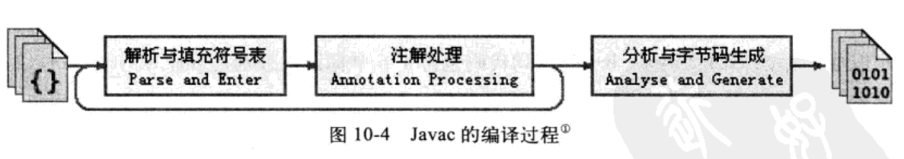
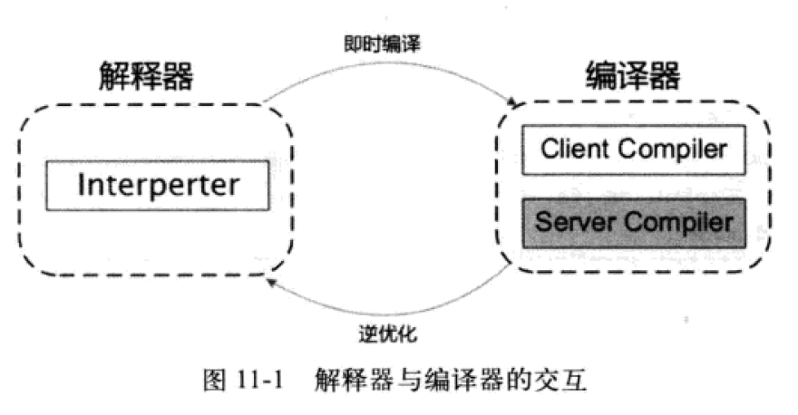

# Java 程序的编译与优化

## 1. javac 的编译过程

### 1.1 解析与填充符号表

1. 词法语法分析，把源代码的字符流转变为标记 Token 集合。语法分析，根据 Token 序列构造抽象语法树 AST abstract syntax tree。能保证程序在结构上正确，即语法正确。
2. 填充符号表。由符号地址和符号信息组成。在语义分析中，符号表的内容可以用于语义检查。在目标代码生成阶段，符号表也被用于分配地址。

### 1.2 注解处理器

可以使用注解处理器插件干预编译器的行为。插件每对 AST 修改一次，就会回到阶段一，指导没有注解处理器对 AST 进行修改。

### 1.3 语义分析和字节码生成

对结构上正确的 AST 进行上下文审查，如检查类型是否匹配等。语义分析可以分为标注检查和控制流分析：

1. 标注检查：检查变量是否被声明，类型是否匹配等。同时也负责常量折叠，即 a = 1 + 2 会被折叠为 a = 3。
2. 控制流与数据流分析：检查使用前是否有赋值，方法每条路径是否有返回值、异常是否等到处理等。
3. 解语法糖 Synatactic Sugar。语法糖可增加程序的可读性并减少出错的概率。这些语法糖会在编译时还原会原始的基础语法结构。
字节码生成。甚至可以填充默认构造方法。

## 2. JIT 等运行期优化技术

JIT（just in time）编译器：把某些频繁执行的代码编译为 native code 来提高执行效率。获取热度的方式有以下两种：

1. 周期性检查栈顶。可以获得调用堆栈，方便深度优化。缺点是采样精度低。
2. 给每个方法添加调用计数器和回边计数器（负责记录方法内循环体执行次数）。JIT 采用此法。
