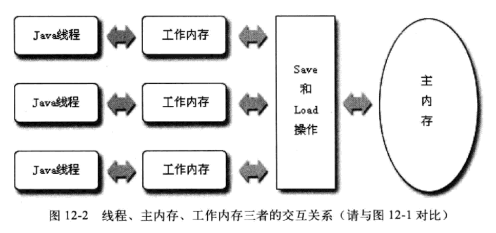
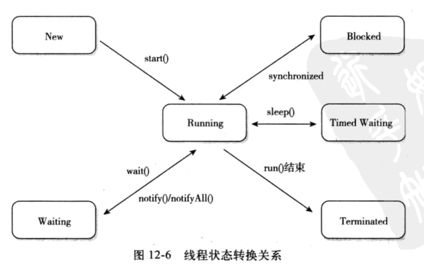

# Java 中的高并发

## 1. Java 内存模型与线程

Java 内存模型规定所有变量都储存在主内存 main memory 中。每条线程还有自己的工作内存，保存了被线程使用到的变量的主内存副本。线程对变量的所有操作都只能在工作内存中进行，而不能直接读写主内存。不同线程之间不共享工作内存中的变量。共享需要靠主内存完成。

## 2. volatile 与 synchronized

volatile

1. 保证此变量对所有线程的可见性。即某线程修改此变量后，所有线程均立刻得到通知。其他线程可立刻获得此变量的最新值。然而在高并发下，volatile 不能保证所有线程都能获得正确的值，即每个线程的工作内存中的此变量仍有可能不一致。
2. 禁止指令重排序优化。靠插入内存屏障 Memory Barrier 指令来保证处理器不发生乱序执行。导致写操作比较慢。但在大多数情况下比 JUC 包中的锁的开销要低。

## 3. 线程与调度

### 3.1 线程的实现方式与调度方式

1. 使用内核线程：由操作系统内核支持，由内核完成线程切换，并通过调度器 scheduler 对线程进行调度，并负责映射到处理器内核上。在用户态和内核态之间切换消耗较多资源，需要调用系统 API。
2. 使用用户线程：完全建立在用户空间的线程，对内核不可见。线程的建立、同步、调度和销毁处于用户态。运行快、支持的线程数目较多。
3. 混合实现：使用处于内核态的线程调度功能和处理器映射，以及处于用户态的廉价操作以及高并发。

调度方式包括

1. 协同式调度
2. 抢占式调度。

### 3.2 线程的状态转换

1. 新建 new：创建后尚未启动的线程。
2. 运行 runable：包括 running 和 ready，可能处于执行状态后者等待执行状态。
3. 无限期等待 waiting：不会被分配 cpu 时间，需要被其他线程显式唤醒。原因包括
   + 没有设置 timeout 参数的 object.wait() 方法
   + 没有设置 timeout 采纳数的 thread.join() 方法
   + LockSupport.park() 方法
4. 限期等待 timed waitting：不会被分配 CPU 时间，无需等待显式唤醒，会在指定时间后由系统唤醒。原因包括：
   + Thread.sleep() 方法
   + 设置了 timeout 参数的 object.wait() 方法
   + 设置了 timeout 参数的 thread.join() 方法
   + LockSupport.parkNanos() 方法
   + LockSupport.parkUntil() 方法
5. 阻塞 blocked：等待其他线程释放排它锁。
6. 结束 terminated：已经终止的线程。

## 4. 线程安全及其实现手段

### 4. 线程安全的等级

1. 不可变 immuatable：无需同步手段。例如使用 final 修饰基本数据类型。后者把对象所有带状态的变量声明为 final。
2. 绝对线程安全：调用者不需要额外的同步手段。例如使用 synchronized 修饰。但可能导致时空复杂度高。
3. 相对线程安全：保证对这个对象的单独操作是线程安全的，可能需要额外的同步手段。
4. 线程兼容：调用对象并不是线程安全的，但可以通过正确的同步手段保证并发场景中的安全。
5. 线程对立：无论如何都做不到线程安全。

实现手段

1. 互斥同步（阻塞同步）：使用临界区、互斥量和信号量等方式。例如使用 synchronized 关键字，也可以靠 JUC 包中的重入锁 reentrant lock 实现。
2. 非阻塞同步：基于冲突检测的乐观并发策略。即先行操作，如果没有其他线程争用数据，则操作成功；否则就额外增加其他补救措施（比如不断重试至成功）。这样使得线程无需被挂起。
3. 无同步方案：如果线程之间不涉及共享数据，则无需同步。此类代码包括：
   + 可重入代码 reentrant code：可以被任意中断而不发生错误。若一个方法的返回结果是可以预测的，即只要输入相同的数据就会得到相同的记过，就认为此代码可重入。
   + 线程本地存储 thread local storage：把共享数据的代码保证在同一个线程中执行。例如生产者-消费者模型中的消费者线程。通常，消费过程都只会产生一个消费者线程。

## 5. 锁优化

1. 自旋锁与自适应自旋锁。由于关键资源的锁定时间远小于执行时间，那么为了锁定该资源而在内核态和用户态中切换是不值得的。若让持有所的线程进入忙循环（自旋）就可以消除这些等待时间。占用 CPU 时间，若占用锁的时间非常长，则效果十分不佳。自适应自旋锁可以动态调整自旋时间。
2. 锁消除。若堆上的所有数据都不会被其他线程访问到，则可以认为这些数据是栈上数据。故无需同步加锁。
3. 锁粗化。对同一个对象反复加锁解锁可能导致性能恶化。故把同步区域扩大可解决此问题。
4. 轻量级锁。
5. 偏向锁。
