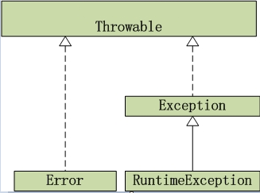

# Java 中的异常处理

**程序运行环境的不确定性, 在编写程序的时候永远无法对所有可能的用户输出进行完全的测试. 这样, 在运行的时候, 就难免会出现异常. 因此，异常处理是每一个程序所必须包含的部分.**

Java 中的异常包括错误 (Error) 和异常 (Exception) 两类. 这两者在继承关系上的共同祖先为 Throwable 类. 通过继承 Throwable 类, 错误和异常都可以被代码块抛出. 然而, 异常和错误仍有不同之处. 其中, 错误表示仅靠程序本身无法恢复的的严重问题, 比如内存溢出 (OutOfMemoryError) 以及栈溢出错误 (StackOverFlowError) 等. 在发生这些错误的时候, 我们除了尽力使程序安全退出外, 并没有较好的办法去解决这些错误. 相比而言, 导致异常的问题的严重程度要低得多. 比如, 通过恰当设计程序的流程并进行充分的检查能够有效避免异常的发生. 因此, 在开发的时候, 我们更应该关注而且可以解决的是程序运行过程中所发生的异常.



## 1. 异常处理的基本方式

在 Java 中实现错误处理的基本方式为使用 try-catch-finally 程序块. 被 try 语句块包围起来的语句所抛出来的异常可以被 catch 语句块中的语句捕获并及时处理. 除此之外, 通过使用 try-catch-finally 程序块, 也可以及时捕获程序块中的语句所抛出的异常. 同时, 无论异常是否发生, finally 语句块中的语句也一定会被执行. 这样, finally 语句块在需要释放某些在 try 中获得的资源的时候就很有用了 (比如释放已经打开的数据库连接和打开的文件等). 除了 try-catch-finally 语句块以外, 一个更加简便的方式是使用 try-catch 程序块也可以捕获并处理异常. 这种方法能保证最小异常安全, 使得在程序出现错误的时候能够得到最基本的处理, 让程序不会因为发生了为未经捕获的异常而崩溃.

```java
private void simpleErrorHandlingExample() {
    String string = "01, , 2010";
    DateFormat format = null;
    format = new SimpleDateFormat("MM, dd, yyyy");
    Date date;
    try {
        date = format.parse(string);
    } catch (ParseException e) {
        System.out.println("ParseException caught!");
        e.printStackTrace();
    }
}
```
 
## 2. 抛出异常

如果程序并不需要在发生错误异常的地方进行错误处理, 比如, 由调用者来捕获程序所发生的异常并给予适当处理, 那么就需要使用 throws/throw 关键字来向调用者抛出异常, 并由调用者予以处理.

```java
public class App {
    public static void main(String[] args) {
        String strDate = "01, , 2010";
        String dateFormat = "MM, dd, yyyy";
        DateParser parser = new DateParser();
        Date date = null;
        try {
            date = parser.getParsedDate(strDate, dateFormat);
        } catch (ParseException e) {
            e.printStackTrace();
        }
    }
}

class DateParser {
    public Date getParsedDate(String strDate, String dateFormat) throws ParseException {
        DateFormat format = new SimpleDateFormat(dateFormat);
        try {
            return format.parse(strDate);
        } catch (ParseException parseException) {
            throw parseException;
        }
    }
}
```

## 3. 自定义异常类

显然, Java 语言所以提供的异常并不能完全覆盖程序运行过程中所可能发生的所有错误和异常. 因此, 通过抛出自定义异常来处理业务所特有的异常时是维持程序稳定运行的重要方法之一. 在 Java 中使用自定义异常类, 首先需要定义一个继承了 Exception 或者 RuntimeException 的自定义异常类.

```java
class TestCustomException {
    public static void main(String[] args) {
        int num1 = 1, num2 = 0;
        TestCustomException tce = new TestCustomException();
        try {
            tce.performCalculation(num1, num2);
        } catch (CustomException e) {
            System.out.println(e.getExceptionCause());
        }
    }
    private int performCalculation(int num1, int num2) throws CustomException {
        int result;
        try {
            result = num1 / num2;
        } catch (ArithmeticException e) {
            throw new CustomException(num1,
                num2);
        }
        return result;
    }
}
class CustomException extends Exception {
    int num1, num2;
    public CustomException(int num1, int num2) {
        this.num1 = num1;
        this.num2 = num2;
    }
    public String getExceptionCause() {
        return String.valueOf(num1 + " can not be divided by " + String.valueOf(num2));
    }
}
```

## 4. 对未捕获的异常的处理方法

在 Java 语言中实现一个的全局异常处理器, 需要在全局异常处理器类中实现 UncaughtExceptionHandler 接口. 在 Java 1.5 之后, JDK 在 Thread 类中提供了一个名为 setDefaultUncaughtExceptionHandler() 的方法来设置针对未捕获的异常的默认处理器. 要实现该类, 需要在处理器类中实现 UncaughtExceptionHandler 接口.

```java
class TestGlobalExceptionHandler {
    public static void main(String[] args) {
        GlobalExceptionHandler globalHandler = new GlobalExceptionHandler();
        Thread.setDefaultUncaughtExceptionHandler(globalHandler);
        new TestGlobalExceptionHandler().performArithmeticOperation(10, 0);
        System.out.println("Program continues");
    }
    public int performArithmeticOperation(int num1, int num2) {
        return num1/num2;
    }
}
class GlobalExceptionHandler implements
    Thread.UncaughtExceptionHandler {
    public void uncaughtException(Thread t, Throwable e) {
        e.printStackTrace();
    }
}
```
