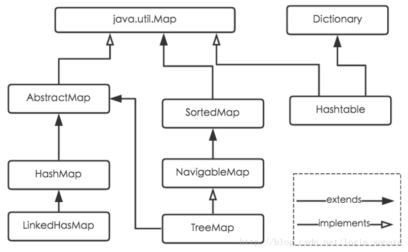

# Java 中的 HashMap, HashTable 与 ConcurrentHashMap

## 1. 三者的概述与比较

ConcurrentHashMap 是 HashMap 的一个子类. 提供了在多线程环境下安全使用的能力. LinkedHashMap 也是 HashMap 的一个子类, 提供了按照元素插入顺序遍历的能力. TreeMap 则是把 (默认) 按照键值升序排序后的 HashMap.

HashMap 与 ConcurrentHashMap 以及 HashTable 的主要差别是:

- HashMap 不是同步的, 线程不安全, 不可用于多线程环境. 而 ConcurrentHashMap 与 HashTable 两者都有同步措施, 可以在多线程环境中使用. 但两者线程安全的实现上有巨大的差别. HashTable 简单粗暴地给每一个需要同步的方法都加上了 synchronized 关键字. 简而言之, 在同一时刻有且只有一个线程能够进行这些需要可能会造成同步问题的操作. 而 ConcurrentHashMap 则是把 hash 桶分成多个 segment, 然后锁定相关的 segment 的方式来进行同步. HashTable 现已被废弃.
- HashMap 允许最多一个 null 值作为 key , value 可以有多个 null. 而 ConcurrentHashMap 和 HashTable 都不允许.
- HashTable 继承 Dictionary 类, HashMap 和 ConcurrentHashMap 继承自 Map 类.  
  

## 2. HashMap 常用方法赏析

HashMap 是 Java 编程中频率十分高的一个集合类. 在底层实现上, HashMap 使用了 hash 桶数组 + 拉链法来构造映射关系. 同时, 当每一个桶内的元素超过 8 个时, 则会被改造为红黑树以维持查询效率.

HashMap 类内有如下几个重要方法的实现值得一看:

- HashMap 的四个构造方法
- 求哈希值的 hash 方法
- get 与 getNode 方法
- containsKey 方法与 containsValue 方法
- put 与 putVal 方法
- remove 与 removeNode 方法
- resize 方法
- treeifyBin 方法
- clear 方法

### 2.1 构造方法

从源码中可以看到, 使用既可以使用默认的构造方法, 也可以用指定了参数的构造方法. 在初始化 HashMap 的时候, 有以下几个参数必须指定, 或者使用默认值:

```java
// 初始大小为 16, 可以传入自定义的大小, 但一定要是 2 的幂
static final int DEFAULT_INITIAL_CAPACITY = 1 << 4;
// 装载因子 0.75, 在内存使用和查询效率之间所做的平衡, 不建议修改
static final float DEFAULT_LOAD_FACTOR = 0.75f;
// 超过 threshold 之后会通过调用 resize 方法来扩充桶数组的大小
int threshold;
```

由于扩容是一个费时费力的操作, 所以能够在构造过程中指定桶数组的初始大小就可以避免频繁扩容. 计算的方法是 `capacity = 最大 key 数目 * loadFator`, 寻找一个比他大的 2 的幂.

### 2.2 hash 方法

通过异或来计算一个 32 位整数并作对象的 hash 返回.

```java
static final int hash(Object key) {
    int h;
    // 把 hash 与 hash 的高 16 位异或得出最终的 hash 值. 以便是的 hash 能够尽可能平均分布在 hash 空间中.
    return (key == null) ? 0 : (h = key.hashCode()) ^ (h >>> 16);
}
```

### 2.3 get 和 getNode 方法

get 是对外暴露的获取元素的方法, 而 getNode 是被 get 包装过后的实际从 HashMap 中查找元素的方法.

```java
public V get(Object key) {
    Node<K,V> e;
    return (e = getNode(hash(key), key)) == null ? null : e.value;
}
/**
 * 找不到元素时返回 null
*/
final Node<K,V> getNode(int hash, Object key) {
    Node<K,V>[] tab; Node<K,V> first, e; int n; K k;
    if ((tab = table) != null && (n = tab.length) > 0 &&
        (first = tab[(n - 1) & hash]) != null) {
        // 如果第一个元素就是目标元素, 就可以直接返回以节省时间. 在 Hash 方法分布得当的情况下,  hash 冲突不会经常发生.
        if (first.hash == hash && // always check first node
            ((k = first.key) == key || (key != null && key.equals(k))))
            return first;
        if ((e = first.next) != null) {
            // 如果该桶下的元素已被用红黑树储存, 则使用在红黑树中查找元素的方法来获取目标元素
            if (first instanceof TreeNode)
                return ((TreeNode<K,V>)first).getTreeNode(hash, key);
            // 否则, 元素还是被储存在链表中, 循环查找即可
            do {
                if (e.hash == hash &&
                    ((k = e.key) == key || (key != null && key.equals(k))))
                    return e;
            } while ((e = e.next) != null);
        }
    }
    return null;
}
```

### 2.4 containsKey 和 containsValue 方法

containsKey 方法是查找 HashMap 中是否存在此 key, 而 containsValue 方法则是查找 HashMap 中是否存在此 value. 相比 containsKey 的简洁操作, containsValue 的操作则复杂很多, 要尽可能避免使用.

```java
public boolean containsKey(Object key) {
    // getNode 方法返回的是包含 key & value 的 HashMap 节点, 则可以利用此特性来判断是否包含此 key
    return getNode(hash(key), key) != null;
}

public boolean containsValue(Object value) {
    Node<K,V>[] tab; V v;
    if ((tab = table) != null && size > 0) {
        // 在桶数组非空的情况下便利整个 HashMap 来确定是否存在目标值
        for (int i = 0; i < tab.length; ++i) {
            for (Node<K,V> e = tab[i]; e != null; e = e.next) {
                if ((v = e.value) == value ||
                    (value != null && value.equals(v)))
                    return true;
            }
        }
    }
    return false;
}
```

### 2.5 put 与 putVal 方法

同在 HashMap 中查找元素的方法类似, 在 HashMap 中存入元素也分为两个函数: 对外公开的 put 方法以及在内部使用的 putVal 方法.

```java
/**
 * 返回修改前的值或者 null
 */
public V put(K key, V value) {
    return putVal(hash(key), key, value, false, true);
}

final V putVal(int hash, K key, V value, boolean onlyIfAbsent,
                boolean evict) {
    Node<K,V>[] tab; Node<K,V> p; int n, i;
    // 在 map 为空的时候, 重新初始化 map
    if ((tab = table) == null || (n = tab.length) == 0)
        n = (tab = resize()).length;
    if ((p = tab[i = (n - 1) & hash]) == null)
        // 桶中对应的位置没有元素, 则直接创建一个链表并初始化第一个元素为目标元素
        tab[i] = newNode(hash, key, value, null);
    else {
        // 桶中对应位置已有元素存在
        Node<K,V> e; K k;
        if (p.hash == hash && ((k = p.key) == key || (key != null && key.equals(k))))
            // 桶中的第一个元素就是目标元素, 则直接修改目标元素为新值
            e = p;
        else if (p instanceof TreeNode)
            // 已经使用红黑树来储存元素, 则调用红黑树相关的方法来存放元素
            e = ((TreeNode<K,V>)p).putTreeVal(this, tab, hash, key, value);
        else {
            // 在链表中寻找目标元素
            for (int binCount = 0; ; ++binCount) {
                if ((e = p.next) == null) {
                    // 在表尾插入新节点
                    p.next = newNode(hash, key, value, null);
                    if (binCount >= TREEIFY_THRESHOLD - 1) // -1 for 1st
                        treeifyBin(tab, hash);
                    break;
                }
                if (e.hash == hash && ((k = e.key) == key || (key != null && key.equals(k))))
                    break;
                p = e;
            }
        }
        // 返回之前的值
        if (e != null) { // existing mapping for key
            V oldValue = e.value;
            if (!onlyIfAbsent || oldValue == null)
                e.value = value;
            afterNodeAccess(e);
            return oldValue;
        }
    }
    ++modCount;
    if (++size > threshold)
        // 扩容
        resize();
    afterNodeInsertion(evict);
    return null;
}
```

### 2.6 remove 与 removeNode 方法

同样, 从 HashMap 中移除元素也分为公开的 remove 方法和在内部使用的 removeNode 方法. 由于桶是基于链表或者红黑树实现的, 在移除元素的时候, 如果使用链表实现, 则需要找到当前元素及其直接前驱; 如果使用红黑树实现, 则需要调用红黑树的相关方法.

```java
public V remove(Object key) {
    Node<K,V> e;
    return (e = removeNode(hash(key), key, null, false, true)) == null ?
        null : e.value;
}

final Node<K,V> removeNode(int hash, Object key, Object value,
                            boolean matchValue, boolean movable) {
    Node<K,V>[] tab; Node<K,V> p; int n, index;
    if ((tab = table) != null && (n = tab.length) > 0 &&
        (p = tab[index = (n - 1) & hash]) != null) {
        Node<K,V> node = null, e; K k; V v;
        if (p.hash == hash &&
            ((k = p.key) == key || (key != null && key.equals(k))))
            // 第一个元素就是目标元素
            node = p;
        else if ((e = p.next) != null) {
            if (p instanceof TreeNode)
                // 在红黑树中查找该元素
                node = ((TreeNode<K,V>)p).getTreeNode(hash, key);
            else {
                // 在链表中查找该元素
                do {
                    if (e.hash == hash &&
                        ((k = e.key) == key ||
                            (key != null && key.equals(k)))) {
                        node = e;
                        break;
                    }
                    p = e;
                } while ((e = e.next) != null);
            }
        }
        if (node != null && (!matchValue || (v = node.value) == value ||
                                (value != null && value.equals(v)))) {
            if (node instanceof TreeNode)
                // 从红黑树中移除该元素
                ((TreeNode<K,V>)node).removeTreeNode(this, tab, movable);
            else if (node == p)
                // 链表中只有一个元素
                tab[index] = node.next;
            else
                // 链表中有多个元素
                p.next = node.next;
            ++modCount;
            --size;
            afterNodeRemoval(node);
            return node;
        }
    }
    return null;
}
```

### 2.7 resize 方法

当 HashMap 中的元素个数超过 threshold 之后, 就需要调用 resize 方法来对桶数组进行扩容, 以降低 hash 冲突的风险.

```java
final Node<K,V>[] resize() {
    Node<K,V>[] oldTab = table;
    int oldCap = (oldTab == null) ? 0 : oldTab.length;
    int oldThr = threshold;
    int newCap, newThr = 0;
    if (oldCap > 0) {
        if (oldCap >= MAXIMUM_CAPACITY) {
            // 超过最大容量之后就不再扩容
            threshold = Integer.MAX_VALUE;
            return oldTab;
        }
        else if ((newCap = oldCap << 1) < MAXIMUM_CAPACITY &&
                    oldCap >= DEFAULT_INITIAL_CAPACITY)
            // 设置新的 threshold 为原值的两倍
            newThr = oldThr << 1; // double threshold
    }
    else if (oldThr > 0) // initial capacity was placed in threshold
        // 第一次使用的时候使用默认值
        newCap = oldThr;
    else {               // zero initial threshold signifies using defaults
        newCap = DEFAULT_INITIAL_CAPACITY;
        newThr = (int)(DEFAULT_LOAD_FACTOR * DEFAULT_INITIAL_CAPACITY);
    }
    if (newThr == 0) {
        // 计算新的 threshold
        float ft = (float)newCap * loadFactor;
        newThr = (newCap < MAXIMUM_CAPACITY && ft < (float)MAXIMUM_CAPACITY ?
                    (int)ft : Integer.MAX_VALUE);
    }
    threshold = newThr;
    @SuppressWarnings({"rawtypes","unchecked"})
    Node<K,V>[] newTab = (Node<K,V>[])new Node[newCap];
    table = newTab;
    if (oldTab != null) {
        // 逐个修改原来的桶中的元素的映射关系
        for (int j = 0; j < oldCap; ++j) {
            Node<K,V> e;
            if ((e = oldTab[j]) != null) {
                oldTab[j] = null;
                if (e.next == null)
                    // 只有一个元素的时候, 位置保持不变
                    newTab[e.hash & (newCap - 1)] = e;
                else if (e instanceof TreeNode)
                    // 采用红黑树储存的话, 则把一部分子树放到新位置
                    ((TreeNode<K,V>)e).split(this, newTab, j, oldCap);
                else { // preserve order
                    Node<K,V> loHead = null, loTail = null;
                    Node<K,V> hiHead = null, hiTail = null;
                    Node<K,V> next;
                    do {
                        next = e.next;
                        if ((e.hash & oldCap) == 0) {
                            if (loTail == null)
                                loHead = e;
                            else
                                loTail.next = e;
                            loTail = e;
                        }
                        else {
                            if (hiTail == null)
                                hiHead = e;
                            else
                                hiTail.next = e;
                            hiTail = e;
                        }
                    } while ((e = next) != null);
                    if (loTail != null) {
                        loTail.next = null;
                        newTab[j] = loHead;
                    }
                    if (hiTail != null) {
                        hiTail.next = null;
                        // 一部分链表节点会被放到新位置以降低冲突, 详情参见 https://blog.csdn.net/login_sonata/article/details/76598675
                        newTab[j + oldCap] = hiHead;
                    }
                }
            }
        }
    }
    return newTab;
}

```

### 2.8 treeifyBin 方法

之前提到过, 当链表长度超过 8 的时候就会触发 treeifyBin 方法, 来把这个桶转化为红黑树. 实际上, 除了链表长度这个要求以外, 还需要满足元素个数大于等于 64 之后才会被转为红黑树. 否则只是简单地通过扩容来降低查找成本.

```java
final void treeifyBin(Node<K,V>[] tab, int hash) {
    int n, index; Node<K,V> e;
    if (tab == null || (n = tab.length) < MIN_TREEIFY_CAPACITY)
        // 只是触发 resize 而没有被转换为红黑树
        resize();
    else if ((e = tab[index = (n - 1) & hash]) != null) {
        // 把链表转换为红黑树
        TreeNode<K,V> hd = null, tl = null;
        do {
            TreeNode<K,V> p = replacementTreeNode(e, null);
            if (tl == null)
                hd = p;
            else {
                p.prev = tl;
                tl.next = p;
            }
            tl = p;
        } while ((e = e.next) != null);
        if ((tab[index] = hd) != null)
            hd.treeify(tab);
    }
}
```

### 2.9 clear 方法

在不需要 HashMap 中的内容时, 可以调用 clear 方法来清空 HashMap 中的内容.

```java
public void clear() {
    Node<K,V>[] tab;
    modCount++;
    if ((tab = table) != null && size > 0) {
        size = 0;
        for (int i = 0; i < tab.length; ++i)
            // 把引用清空
            tab[i] = null;
    }
}
```
